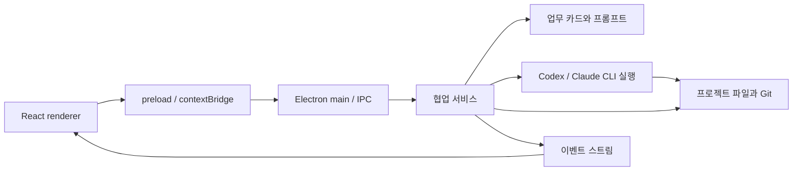

# 아키텍처

이 문서는 현재 MVP의 코드 경계와 저장 형식을 설명합니다. 사용자 기능과 실행 방법은 [README](../README.md)를 참고하세요.

## 프로세스 경계

| 위치 | 책임 |
| --- | --- |
| `src/shared/types.ts` | UI와 메인 프로세스가 공유하는 자료형과 IPC 계약 |
| `src/renderer/` | 프로젝트·업무·논쟁·이력 화면과 사용자 입력 |
| `src/main/preload.ts` | 허용된 기능만 `window.collab`으로 노출 |
| `src/main/main.ts` | 창 생성, 프로젝트·CLI 실행 파일 선택 대화 상자, IPC 연결 |
| `src/main/services/index.ts` | 프로젝트·업무 상태 전이, 토론 순서, 자동 계획, 실행·검수 조율 |
| `src/main/services/prompts.ts` | 프로젝트 헌장, 업무 카드, 최근 기록으로 단계별 요청 문장 구성 |
| `src/main/services/cli.ts` | 기기별 CLI 실행 파일 탐색, 구독 로그인 확인, CLI 프로세스 실행, 표준 출력·오류 저장 |
| `src/main/services/repository.ts` | 프로젝트 파일, Git 커밋, 업무별 worktree 관리 |
| `src/main/services/conversation-import.ts` | 로컬 Codex·Claude JSONL 검색, 발화 추출, 프로젝트 대화 사본 보관 |
| `assets/`와 `scripts/build-icons.*` | SVG 원본, PNG·ICO·ICNS 패키지 아이콘과 생성 스크립트 |

Renderer는 Node.js 파일 API에 직접 접근하지 않습니다. Electron의 `contextIsolation`이 켜져 있고 `nodeIntegration`은 꺼져 있습니다. 메인 프로세스가 파일과 외부 CLI를 다룹니다.

## 데이터 모델과 보존

`Project`에는 폴더, 목표, 헌장, 기본 토론 횟수와 프로젝트 CLI 세션 목록이 있습니다. `Task`에는 지시, 완료 기준, 선행 업무, 실행·검수 모델, 상태와 업무별 CLI 세션 목록이 있습니다. 각 진행 단계는 `CollaborationEvent`로 남습니다. 이벤트에는 프로젝트와 업무 ID, 행위자, 단계, 시각, 내용, 토론 회차가 포함됩니다. `ExternalSession`에는 제공자, 세션 ID, 용도(프로젝트·토론·실행·검수), 작업 폴더, 생성·갱신 시각, 기기 ID가 있습니다.

프로젝트의 `.llm-collaboration/project.json`과 `tasks.json`은 현재 상태를 빠르게 읽기 위한 자료입니다. `events.jsonl`은 단계별 기록을 순서대로 추가하는 로그입니다. `runs/*.jsonl`에는 각 CLI 호출의 입력 프롬프트, 세션 ID와 출력 원문을 저장합니다. 앱이 아는 프로젝트 목록은 Electron `userData/projects.json`에 별도로 저장하며, 그 기기를 구별하는 `session-host-id`도 같은 사용자 데이터 폴더에 만듭니다. 수동으로 선택한 CLI 실행 파일 경로는 같은 위치의 `cli-settings.json`에 저장합니다. 이 경로 설정과 기기 ID는 프로젝트 Git에 넣지 않습니다. 실제 프로젝트 원문과 산출물은 사용자가 고른 프로젝트 폴더에 있습니다.

이 구조는 이벤트와 CLI 호출 원문을 보존하면서도 UI가 전체 로그를 재생하지 않고 현재 업무 상태를 읽게 합니다. 검색은 `events.jsonl`의 이벤트와 `runs/*.jsonl`의 각 원문 줄을 함께 확인합니다. 일치한 원문 줄은 발췌로 표시하고, `readTranscript`가 해당 실행 파일 전체를 열어 줍니다. 원문 열기는 경로를 정규화한 뒤 프로젝트의 `runs/` 안에 있는 JSONL 파일만 허용합니다. 의미 기반 검색이나 과거 자료를 찾아 프롬프트에 자동 주입하는 기능은 없습니다.

다른 컴퓨터에서 프로젝트 Git 저장소를 클론하면, 새 컴퓨터의 Electron `userData/projects.json`에는 그 경로가 없습니다. 새 프로젝트 화면에서 클론한 폴더를 지정하면 `createProject`가 이미 있는 `project.json`을 읽어 등록하고 기존 프로젝트를 반환합니다. 기록 파일을 새 내용으로 덮어쓰지 않습니다. Git에 남은 이전 기기의 세션 ID는 이력으로 보존하지만 현재 기기의 `session-host-id`와 일치하지 않으므로 모델 호출에 재사용하지 않습니다. 프로젝트 세션이 현재 기기에 없으면 새로 만듭니다. 각 제품 CLI가 자체적으로 보관하는 재개 가능한 세션 파일은 이 프로젝트의 Git 기록에 포함되지 않습니다.

## 외부 CLI 세션

프로젝트 생성과 기존 프로젝트 열기에서 Codex·Claude의 프로젝트 시작 세션이 없으면 생성합니다. CLI 로그인 또는 실행에 실패하면 프로젝트를 남기고 오류 이벤트를 기록합니다. 이후 같은 프로젝트를 다시 열 때 누락된 현재 기기 세션을 다시 시도합니다.

모델 호출은 `trackedModel`을 거칩니다. 현재 기기와 모델 제공자·용도가 같은 세션 ID를 찾고, 있으면 Codex는 `codex exec resume <ID>`, Claude는 `claude -p --resume <ID>`로 이어서 실행합니다. 없으면 새 CLI 세션을 만들고 반환된 ID를 프로젝트 또는 업무에 기록합니다. 토론은 업무별 양쪽 모델 세션, 구현은 실행 담당 세션, 검수는 검수 담당 세션을 따로 유지합니다. 자동 업무 계획은 해당 제공자의 프로젝트 세션을 사용합니다. 시작된 CLI 호출의 입력과 출력은 앱의 JSONL 로그에 남고 프로젝트 메타데이터와 함께 로컬 Git에서 추적합니다. [Codex 비대화형 세션](https://learn.chatgpt.com/docs/non-interactive-mode), [Claude Code 세션 재개](https://code.claude.com/docs/en/headless)

`readSessionHistory`는 프로젝트·업무에 등록된 세션 ID를 확인하고, 해당 ID가 기록된 이벤트에 첫 JSONL 행의 요청 문장을 연결해 반환합니다. 원본 응답은 이벤트에, 전체 CLI 출력은 `runs/*.jsonl`에 있으므로 모델 앱과 연결이 끊겨도 이 앱에서 기록을 읽을 수 있습니다. 이 기록 열람은 다른 컴퓨터에서 복제한 프로젝트에도 적용됩니다. `openSession`은 등록된 **현재 기기** 세션만 허용하고, Windows에서는 명령 프롬프트, macOS에서는 Terminal을 열어 `codex resume --include-non-interactive <ID>` 또는 `claude --resume <ID>`를 실행합니다. 업무 worktree가 이미 정리돼 작업 폴더가 없으면 프로젝트 폴더에서 엽니다. 다른 기기의 세션 카드는 화면에 남지만 재개 버튼은 비활성화됩니다. 별도의 `openDesktopSession` IPC는 프로젝트에 기록된 현재 기기 세션과 제공자를 확인한 뒤 Codex에는 `codex://threads/<ID>`, Claude에는 `claude://resume?session=<ID>` 링크를 운영체제에 전달합니다. Codex `exec`와 Claude `-p` 대화는 데스크톱 앱 사이드바에 자동 등록되지 않습니다. Claude Code 데스크톱은 해당 CLI 대화를 가져와 별도 세션으로 이어갈 수 있지만, 이후 원본 CLI 대화와 내용이 자동 동기화된다고 가정하지 않습니다. [Codex CLI 명령](https://learn.chatgpt.com/docs/developer-commands), [Codex 앱 딥 링크](https://learn.chatgpt.com/docs/reference/commands), [Claude Code 데스크톱과 CLI](https://code.claude.com/docs/en/desktop), [Claude 세션 링크 동작](https://github.com/anthropics/claude-code/issues/80773)

## 토론과 업무 분장

프로젝트의 `importedConversations`는 가져온 Codex·Claude 대화의 메타데이터를 보관합니다. 원본 JSONL과 추출한 사용자·모델 발화는 `.llm-collaboration/imports/<해시>.jsonl` 및 `.json`에 복사해 로컬 Git으로 추적합니다. 로컬 세션 목록은 사용자의 `.codex/sessions`, `.claude/projects`에서 최근 JSONL을 찾아 만듭니다. 가져온 대화를 연결한 업무는 시작과 최근 발화를 길이 제한이 있는 `sourceContext`로 업무 카드에 반복 포함합니다. 원본 전체는 프로젝트에 남고, 원래 채팅과의 양방향 동기화나 원래 세션 ID로의 자동 재개는 수행하지 않습니다.

기본 토론은 양측의 독립 제안으로 시작합니다. 첫 회차에서는 서로의 제안에 반론을 제기하고, 두 번째 회차부터는 상대의 최신 반론과 답변에 답합니다. 설정한 회차가 끝나면 두 모델이 상대의 최종 답변을 평가합니다. 이어 검수 담당 모델이 두 평가와 기록을 바탕으로 합의된 결정, 남은 이견과 판단 근거, 실행 단계, 완료 기준과 검증 방법을 종합합니다. 이 종합 결과를 업무의 `debateSummary`와 결론 이벤트에 저장합니다. 사용자는 논쟁을 본 뒤 특정 모델 또는 양쪽에 추가 질문을 보내고 회차를 더 실행할 수 있습니다.

업무는 사용자가 직접 정의하거나 `planTasks`로 요청을 최대 12개 업무로 분해할 수 있습니다. 자동 계획은 Codex 구독 로그인이 가능하면 Codex를 사용하고, 아니면 Claude를 사용합니다. 계획 원문과 생성된 업무가 기록되며 사용자가 각 업무를 편집할 수 있습니다. 자동 담당 선택(`autoChoices`)은 업무 텍스트의 신호와 현재 실행 배정 수를 기준으로 한 결정적 규칙입니다. 현재 자동 계획 자체를 두 모델이 서로 논쟁하며 교차 검수하지는 않습니다.

## 맥락 유지

`taskCard`는 각 모델 호출에 프로젝트 목표, 헌장, 업무 지시와 완료 기준, 담당 모델, 현재 상태, 토론·검수 요약과 최근 업무 이벤트를 넣습니다. 현재 구현은 업무별 최근 28개 이벤트를 뽑고 각 이벤트 문장을 최대 2,200자로 줄여 입력 길이를 제한합니다. 전체 원문은 로그에 남깁니다. 따라서 오래된 중요한 결정은 프로젝트 헌장이나 업무 지시에 명시해야 다음 호출에서도 항상 전달됩니다.

## 실행과 검수 경계

계획·논쟁·검수 호출은 읽기 전용 모드로, 실제 구현 호출은 쓰기 가능한 업무 전용 Git worktree에서 실행하도록 CLI 어댑터가 구분합니다. Claude Code에는 읽기 단계에 `Read,Glob,Grep`, 쓰기 단계에 `Read,Glob,Grep,Edit,Write,Bash` 도구를 명시합니다. `repository.ts`는 업무별 브랜치와 worktree를 만들고 산출물을 커밋합니다. 실행 뒤 다른 제공자의 모델이 완료 기준을 검수합니다. 수정 요청을 받으면 실행 모델이 같은 브랜치에서 다시 고치고 한 차례 더 검수합니다. 두 번의 검수에도 승인되지 않으면 브랜치를 보존하고, 승인되면 프로젝트 저장소에 병합합니다. 검수 결과는 모델의 판단이므로 자동 승인만으로 제품의 정확성을 보장하지 않습니다.

프로젝트 메타데이터 커밋과 업무 산출물 커밋은 로컬 Git 작업입니다. 원격 Git 저장소를 설정하거나 자동으로 푸시하는 코드는 없습니다.

프로젝트 삭제는 등록된 프로젝트 ID·경로·이름을 재확인하고 진행 중인 업무, 중첩 등록 프로젝트, 외부 Git worktree, 보호해야 할 사용자 기본 폴더를 검사합니다. 통과하면 Electron `shell.trashItem`으로 앱이 만든 프로젝트별 worktree 폴더와 프로젝트 폴더를 휴지통에 이동하고, 마지막에 등록 목록에서 제거합니다. 휴지통 이동 함수를 서비스에 주입해 실제 파일을 건드리지 않는 단위 테스트를 실행합니다.

서로 다른 업무의 모델 호출은 화면에서 동시에 시작할 수 있습니다. 서비스는 업무별 활성 실행을 추적해 같은 업무의 중복 실행을 막고, 공통 프로젝트 저장소에 대한 Git 작업은 잠금으로 순서를 정합니다. 따라서 동시 실행이 가능해도 Git 통합이나 CLI 구독 한도에 따라 대기할 수 있습니다.

## CLI와 운영체제

CLI 경로는 기기마다 결정합니다. 사용자 지정 경로가 있으면 해당 파일을 먼저 사용합니다. 자동 탐색에서는 `PATH`, 사용자 홈의 `.local/bin`, macOS의 Homebrew 설치 위치를 살펴봅니다. Windows에서는 npm 설치가 만든 `codex.cmd`/`claude.cmd` shim과 `codex.exe`/`claude.exe`를 찾고, Codex는 `%LOCALAPPDATA%\OpenAI\Codex\bin\*\codex.exe`도 찾습니다. 설치된 Codex 데스크톱 앱이 제공하는 실행 파일을 재사용할 수 있으므로 Windows portable 패키지 안에 CLI를 복사하지 않습니다. 사이드바는 찾은 실행 파일과 버전, `codex login status` 또는 `claude auth status`에서 읽은 로컬 구독 로그인 상태를 표시합니다. **경로 지정**은 실행 파일을 검증한 뒤 이 사용자 계정의 `cli-settings.json`에만 저장하고, **자동 탐색**은 그 지정을 지웁니다. **상태 새로고침**은 두 CLI를 다시 탐색하고 인증 상태를 다시 읽습니다. 앱에는 계정 정보나 API 키 입력 화면이 없고 CLI 자격 증명을 따로 저장하지 않습니다.

CLI 호출은 실행 파일 종류에 따라 다릅니다. Windows의 `.cmd` shim은 버전·로그인 확인과 모델 실행 모두 `cross-spawn`으로 인자를 배열로 전달해 시작합니다. 네이티브 실행 파일은 짧은 상태 확인에 `execFile`, 모델 실행에 `spawn`을 사용합니다. 모델 프롬프트는 표준 입력으로 전달하고 JSONL 표준 출력을 줄 단위로 저장·파싱합니다. Codex는 `codex exec --json`, Claude Code는 `claude -p --output-format stream-json`을 사용합니다. 두 제품의 옵션과 출력 형식은 업데이트될 수 있으므로 버전 호환성 검사가 필요합니다. 특히 현재 사용한 Claude Code `--permission-prompts none`은 v2.1.259 이상에서 지원됩니다. [Codex 인증](https://learn.chatgpt.com/docs/auth), [Codex 비대화형 실행](https://learn.chatgpt.com/docs/non-interactive-mode), [Claude Code CLI 명령](https://code.claude.com/docs/en/cli-reference)

Windows와 macOS에서 같은 TypeScript 소스를 사용합니다. 경로는 Node `path`로 조합하고, 앱 창 생명 주기에서 macOS의 창 재활성화를 처리합니다. Windows 창의 메뉴 바와 애플리케이션 메뉴는 숨기고, macOS에서는 시스템 메뉴를 유지합니다. 패키징은 Windows에서 `package:win`으로 NSIS·portable, macOS에서 `package:mac`으로 DMG·ZIP을 만듭니다. `assets/icon.svg`가 아이콘 원본이고 `npm run icons:png`는 이를 PNG로 변환합니다. `scripts/build-icons.py`는 Pillow를 사용해 PNG에서 ICO·ICNS를 만듭니다. Electron 창과 빌드 리소스는 PNG를, OS별 패키지는 ICO·ICNS를 사용합니다. 현재 macOS 서명·공증, 각 OS의 설치 파일 검증, 여러 CLI 설치 방식에 대한 호환성 검증은 별도의 후속 작업입니다.

## 변경하기 쉬운 경계

- 새 모델 제공자: `Provider`와 CLI 어댑터의 인증·인자·출력 파서를 확장합니다. 저장 형식과 화면은 공유 자료형을 통해 이어집니다.
- 토론 정책: 단계별 프롬프트와 협업 서비스의 단계 전이를 함께 바꿉니다. 사용자 질문과 토론 회차는 이벤트로 남깁니다.
- 업무 상태: `TaskStatus`와 UI 표시, Git 통합 조건을 함께 검토합니다.
- 검색: `events.jsonl`과 `runs/*.jsonl`을 원본으로 유지하면서 별도 색인을 추가할 수 있습니다.

프롬프트 생성과 선택·변환 같은 계산은 가능한 한 입력에서 출력을 만드는 함수로 두고, 파일 기록·Git·프로세스 실행은 서비스 경계에서 처리합니다. 이 구분을 유지하면 모델별 CLI 변경과 화면 변경이 저장 형식에 덜 영향을 줍니다.
